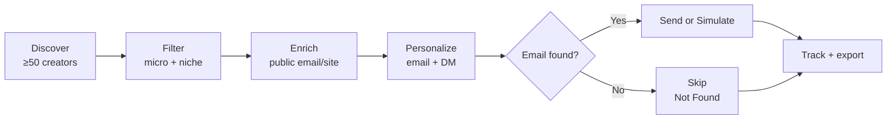
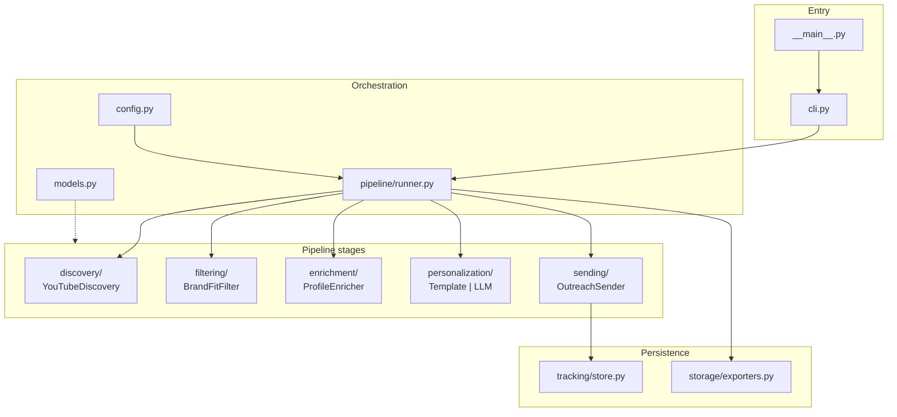
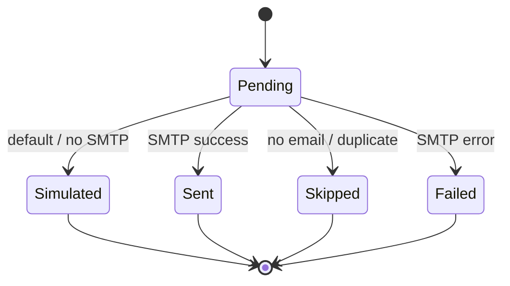
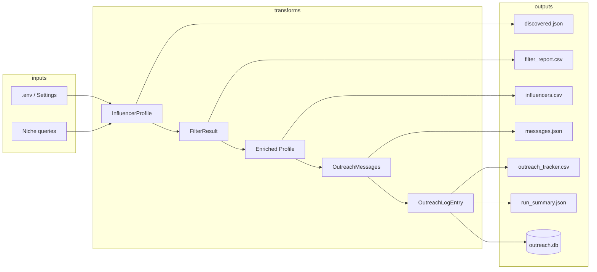

# EDXSO Assignment 1 — Automated Micro-Influencer Outreach

Production-minded Python pipeline that discovers micro-influencers, filters for brand fit,
enriches public contact signals, personalizes outreach, and tracks every send attempt.

**Never fabricates emails or follower metrics.** Missing emails are stored as `Not Found`.

## Architecture

### System overview


### End-to-end pipeline



### Component map



### Discovery decision flow


### Send + tracking states



### Data flow



## Pipeline stages

| Stage | Module | Behavior |
|-------|--------|----------|
| Discovery | `discovery/youtube.py` | YouTube Data API if `YOUTUBE_API_KEY` is set; otherwise public `yt-dlp` search |
| Filter | `filtering/brand_fit.py` | Micro band (5k–100k), platform, engagement soft-check, tech niche keywords |
| Enrich | `enrichment/enricher.py` | Concurrent public HTML scrape for mailto / website; no invented contacts |
| Personalize | `personalization/` | Template engine by default; optional OpenAI-compatible LLM |
| Send | `sending/sender.py` | Simulate by default; optional SMTP |
| Track | `tracking/store.py` | SQLite + JSON/CSV exports, dedupe keys |

## Quick start

```bash
python -m venv .venv
# Windows
.venv\Scripts\activate
# macOS/Linux
source .venv/bin/activate

pip install -e ".[dev]"
cp .env.example .env

# Run full pipeline (simulate sends)
influencer-outreach run --niche technology --limit 60

# Or:
python -m influencer_outreach.cli run --niche technology --limit 60
```

Artifacts land under `data/`:

- `data/raw/discovered.json`
- `data/processed/filter_report.csv`
- `data/processed/influencers.csv`
- `data/outreach/messages.json`
- `data/outreach/outreach_tracker.csv`
- `data/outreach/run_summary.json`

## Configuration

See `.env.example`. Important knobs:

| Variable | Default | Notes |
|----------|---------|-------|
| `NICHE` | `technology` | Primary assignment niche |
| `MIN_FOLLOWERS` / `MAX_FOLLOWERS` | 5k / 100k | Micro-influencer band |
| `YOUTUBE_API_KEY` | empty | Recommended for higher-quality discovery |
| `SMTP_*` | empty | Leave empty to simulate |
| `OPENAI_API_KEY` | empty | Falls back to local templates |

## Design notes (quality & scale)

- **Typed domain models** (`pydantic`) shared across stages — easy to add Instagram/TikTok providers.
- **Pluggable discovery** via `DiscoveryProvider` ABC.
- **Concurrent enrichment** with bounded workers.
- **Idempotent outreach** via SQLite `dedupe_key` (safe re-runs).
- **CLI** with Typer + Rich summaries for ops use.

## Tests

```bash
pytest -q
```

## Project layout

```
src/influencer_outreach/
  discovery/       # YouTube provider
  filtering/       # Brand-fit rules
  enrichment/      # Public contact enrichment
  personalization/ # Template + optional LLM
  sending/         # SMTP / simulate
  tracking/        # SQLite tracker
  storage/         # CSV/JSON exporters
  pipeline/        # Orchestration
  cli.py
```

## Assignment mapping

1. **Discovery** — ≥50 YouTube tech creators via API or yt-dlp (real public metadata).
2. **Filtering** — technology / developer-education brand-fit + micro follower band.
3. **Enrichment** — public email/website extraction; `Not Found` when unavailable.
4. **Personalization** — niche/theme-aware email (60–90 words) + short DM.
5. **Sending** — simulated by default; real SMTP when configured.
6. **Tracking** — CSV/JSON/SQLite with influencer, email, generated, sent, date, status.

## License

Assignment submission code — use at your own risk for outreach compliance (CAN-SPAM / GDPR).
