# EDXSO Assignment 1 — Automated Micro-Influencer Outreach

Production-minded Python pipeline that discovers micro-influencers, filters for brand fit,
enriches public contact signals, personalizes outreach, and tracks every send attempt.

**Never fabricates emails or follower metrics.** Missing emails are stored as `Not Found`.

## AI personalization (internship focus)

This is not a single frozen email template. Every qualified creator goes through an **AI personalization stack**:

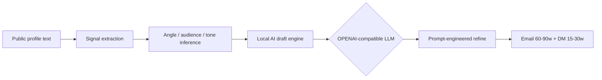

### What the AI layer does

1. **Feature extraction** — niche themes, content angle (`ai_ml`, `career`, `devops`, …), audience hint, tone, hook phrase from public about/meta text  
2. **Local AI draft** — multi-pattern subject / email / DM generation (`method=local_ai_engine`)  
3. **LLM refine (used in sample run)** — Gemini via OpenAI-compatible API + structured JSON prompt ([`prompts/outreach_personalization.txt`](prompts/outreach_personalization.txt)) → `method=llm_refined`  
4. **Model rotation / fallbacks** — free-tier resilient (`gemini-flash-lite-latest`, `gemini-3.1-flash-lite`, `gemini-3.5-flash-lite`, `gemini-3.6-flash`, …)  
5. **CLI**

```bash
python scripts/enrich_sample_notes.py          # refresh public about/meta signals
python scripts/batch_llm_personalize.py        # LLM-refine all sample creators
# or:
influencer-outreach personalize
```

### Live AI sample metrics

From [`examples/sample_run/messages.meta.json`](examples/sample_run/messages.meta.json):

| Metric | Value |
|--------|-------|
| Messages | **54** |
| LLM-refined | **54 / 54** |
| Unique subjects | **54 / 54** |
| Primary models used | Gemini Flash Lite / 3.x Flash family |

Example subjects from the real LLM run:

- *Helping your early-career devs bridge the gap to professional tech roles*
- *Engineering rigor in AI content: Collaboration with EDXSO*
- *Patrick, leveling up software engineers with applied AI tools*

**Live demo:** https://edxso-influencer-outreach.vercel.app  
**Repo:** https://github.com/nishant-uxs/edxso-influencer-outreach

## Submission pack (Assignment §10)

| Requirement | Link / location |
|-------------|-----------------|
| Live demo | https://edxso-influencer-outreach.vercel.app |
| GitHub repository | https://github.com/nishant-uxs/edxso-influencer-outreach |
| README / documentation | This file + [Architecture diagrams](#architecture) |
| Working demo / screenshots | [docs/screenshots/](docs/screenshots/) · [docs/demo/](docs/demo/) |
| Influencer dataset (54 real micro-creators) | [examples/sample_run/influencers.csv](examples/sample_run/influencers.csv) |
| Filter report | [examples/sample_run/filter_report.csv](examples/sample_run/filter_report.csv) |
| Sample personalized outreach messages | [examples/sample_run/messages.json](examples/sample_run/messages.json) (**54/54 LLM-refined**) |
| AI run metadata | [examples/sample_run/messages.meta.json](examples/sample_run/messages.meta.json) |
| Enriched profile signals | [examples/sample_run/enriched_profiles.json](examples/sample_run/enriched_profiles.json) |
| Outreach tracker | [examples/sample_run/outreach_tracker.csv](examples/sample_run/outreach_tracker.csv) |
| Run summary | [examples/sample_run/run_summary.json](examples/sample_run/run_summary.json) |
| Automation workflow | CLI pipeline `influencer-outreach run` · [Mermaid flows](#architecture) |
| Setup instructions | [Quick start](#quick-start) · [`.env.example`](.env.example) |
| APIs / tools used | [APIs & tools](#apis--tools-used) |

**Integrity note:** all follower counts and emails come from public YouTube/profile text. Unavailable emails are explicitly `Not Found` — never guessed.

### Demo screenshots

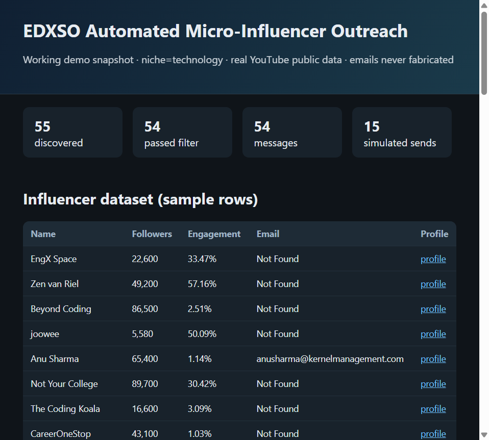

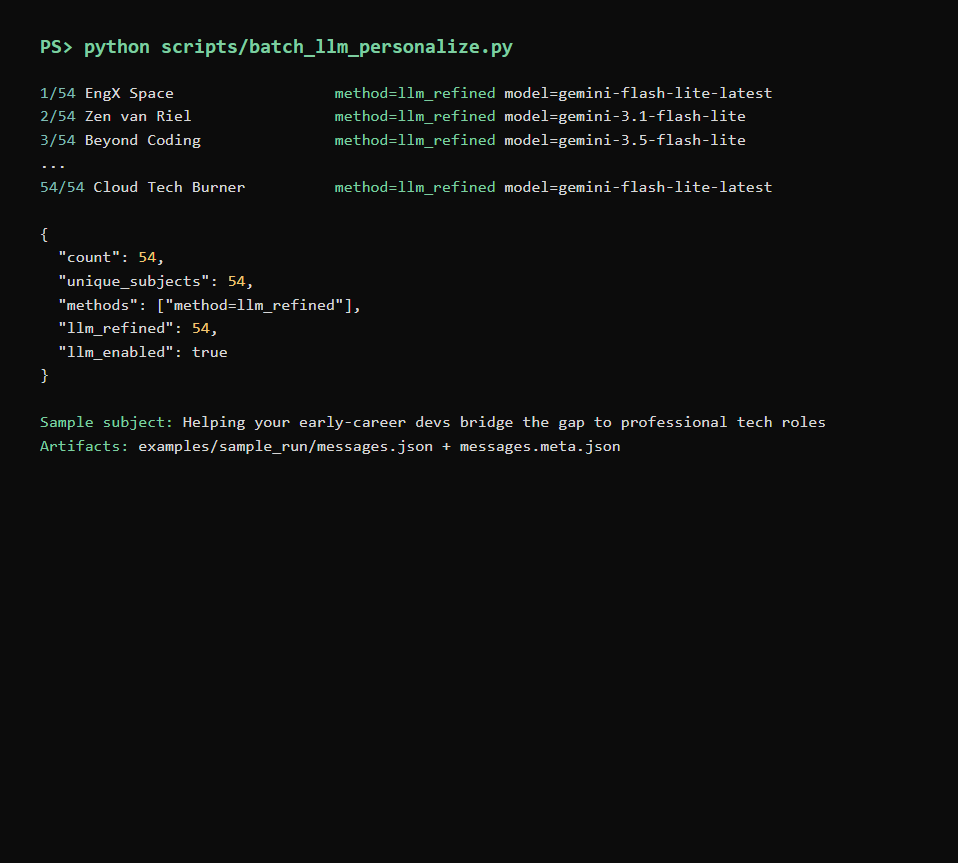

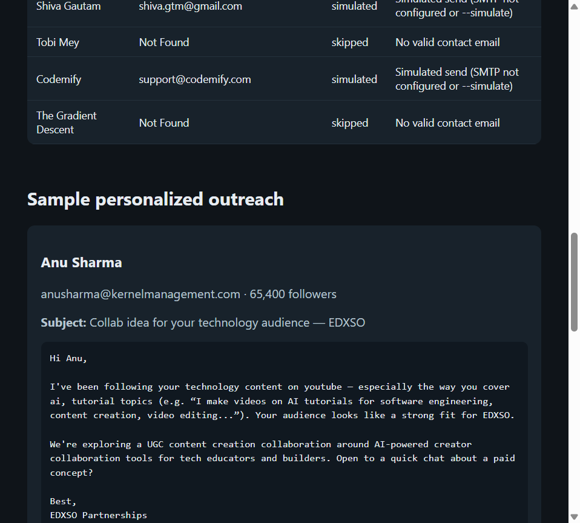

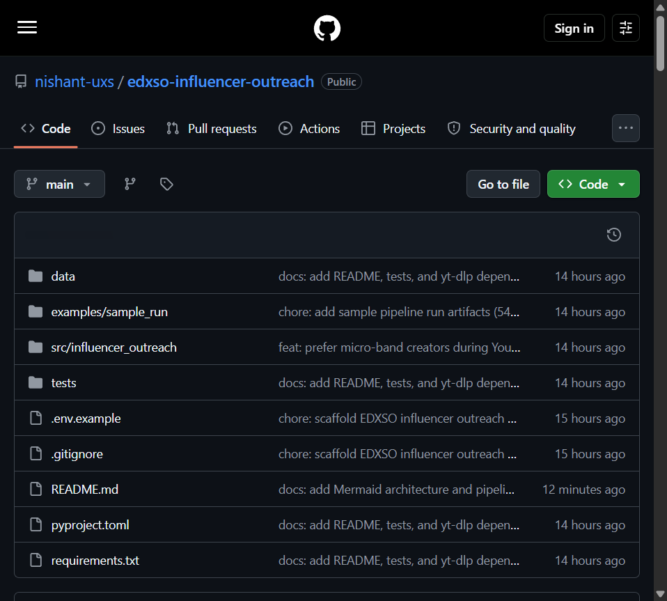

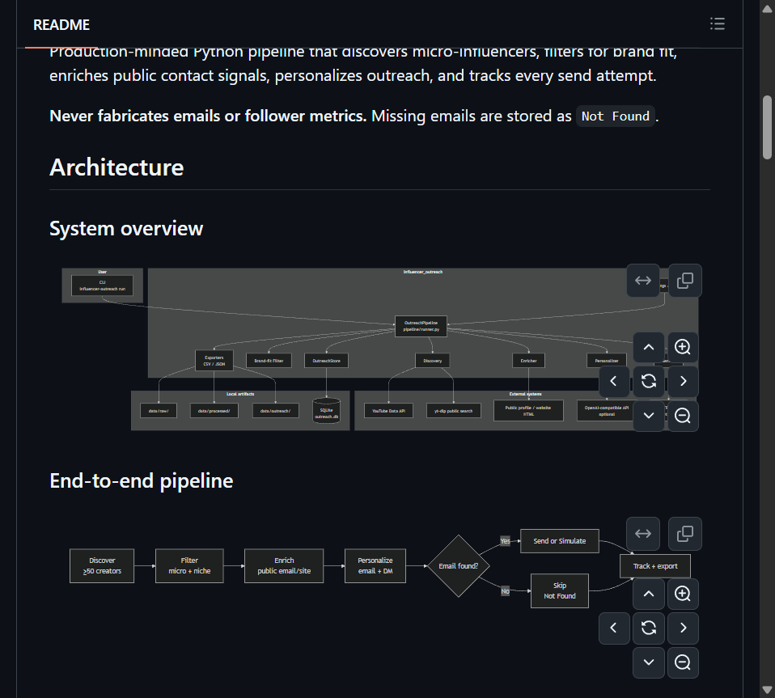

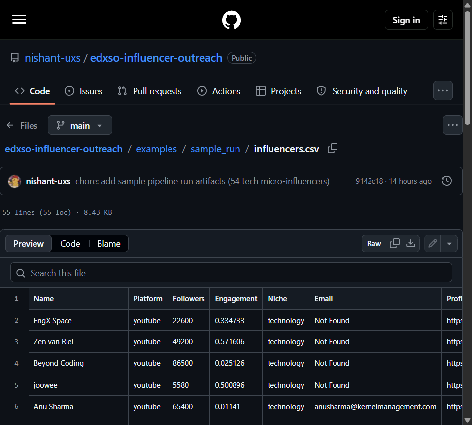

### Live sample run metrics

From [`examples/sample_run/run_summary.json`](examples/sample_run/run_summary.json) + [`enrichment_quality.json`](examples/sample_run/enrichment_quality.json):

| Metric | Value |
|--------|-------|
| Niche | technology |
| Discovered | 55 |
| Passed micro + brand-fit filter | 54 |
| Messages generated (LLM-refined) | 54 |
| Validated public emails | **15** (rest explicitly `Not Found`) |
| Engagement method | **mean(recent video views) / subscribers** (public yt-dlp stats) |
| Emails simulated | 15 |

**Integrity:** no guessed emails, no fabricated follower/engagement numbers. Missing contacts stay `Not Found`.

Open the static demo page locally after clone:

```bash
python scripts/build_demo_page.py
python -m http.server 8765
# visit http://127.0.0.1:8765/docs/demo/index.html
```

## Architecture

### System overview

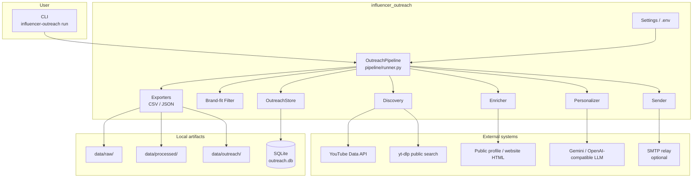

### End-to-end pipeline

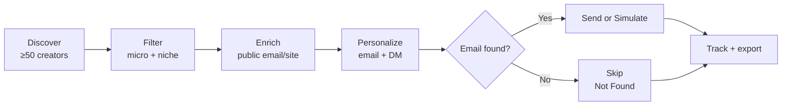

### Component map

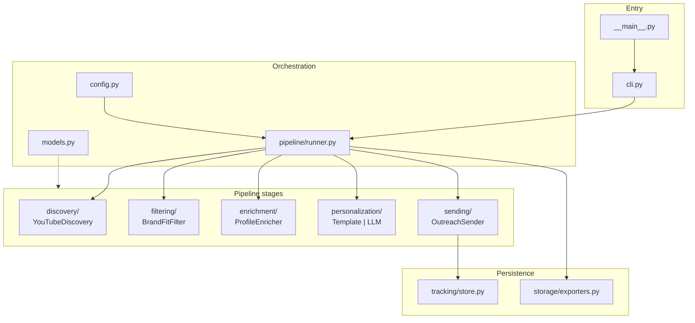

### Discovery decision flow

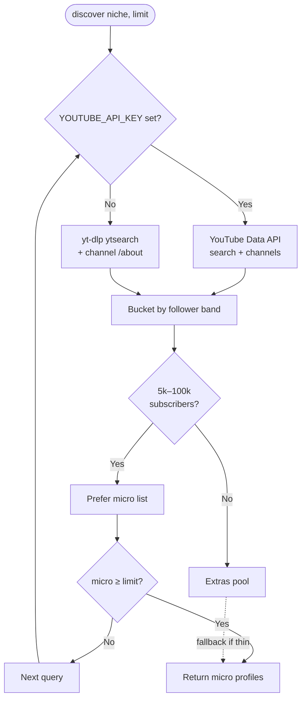

### Send + tracking states

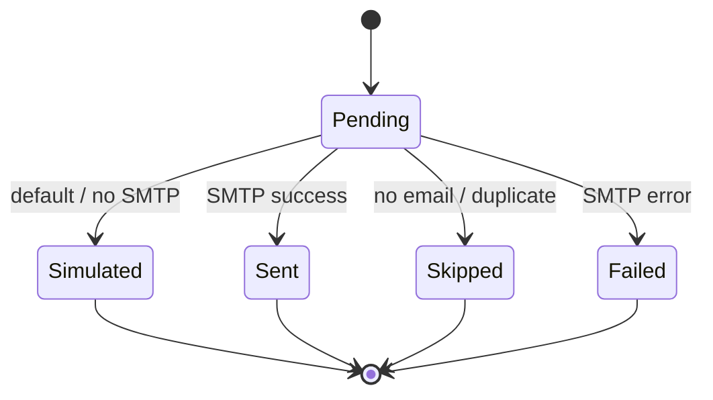

### Data flow

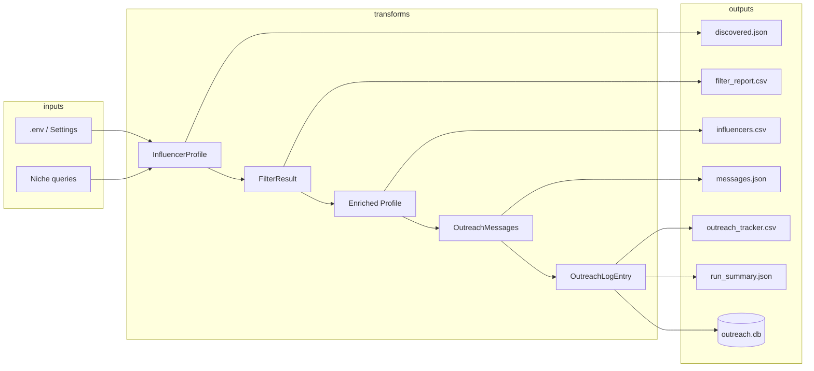

## Pipeline stages

| Stage | Module | Behavior |
|-------|--------|----------|
| Discovery | `discovery/youtube.py` | YouTube Data API if `YOUTUBE_API_KEY` is set; otherwise public `yt-dlp` search |
| Filter | `filtering/brand_fit.py` | Micro band (5k–100k), platform, engagement soft-check, tech niche keywords |
| Enrich | `enrichment/enricher.py` | Concurrent public HTML scrape for mailto / website; no invented contacts |
| Personalize | `personalization/` | Local AI draft + **LLM refine** (Gemini OpenAI-compat); prompt in `prompts/` |
| Send | `sending/sender.py` | Simulate by default; optional SMTP |
| Track | `tracking/store.py` | SQLite + JSON/CSV exports, dedupe keys |

## Quick start

```bash
python -m venv .venv
# Windows
.venv\Scripts\activate
# macOS/Linux
source .venv/bin/activate

pip install -e ".[dev]"
cp .env.example .env

# Run full pipeline (simulate sends)
influencer-outreach run --niche technology --limit 60

# Or:
python -m influencer_outreach.cli run --niche technology --limit 60
```

Artifacts land under `data/`:

- `data/raw/discovered.json`
- `data/processed/filter_report.csv`
- `data/processed/influencers.csv`
- `data/outreach/messages.json`
- `data/outreach/outreach_tracker.csv`
- `data/outreach/run_summary.json`

## Configuration

See `.env.example`. Important knobs:

| Variable | Default | Notes |
|----------|---------|-------|
| `NICHE` | `technology` | Primary assignment niche |
| `MIN_FOLLOWERS` / `MAX_FOLLOWERS` | 5k / 100k | Micro-influencer band |
| `YOUTUBE_API_KEY` | empty | Recommended for higher-quality discovery |
| `SMTP_*` | empty | Leave empty to simulate |
| `OPENAI_API_KEY` | empty | Falls back to local templates |

## Design notes (quality & scale)

- **Typed domain models** (`pydantic`) shared across stages — easy to add Instagram/TikTok providers.
- **Pluggable discovery** via `DiscoveryProvider` ABC.
- **Concurrent enrichment** with bounded workers.
- **Idempotent outreach** via SQLite `dedupe_key` (safe re-runs).
- **CLI** with Typer + Rich summaries for ops use.

## Tests

```bash
pytest -q
```

## Project layout

```
src/influencer_outreach/
  discovery/       # YouTube provider
  filtering/       # Brand-fit rules
  enrichment/      # Public contact enrichment
  personalization/ # Template + optional LLM
  sending/         # SMTP / simulate
  tracking/        # SQLite tracker
  storage/         # CSV/JSON exporters
  pipeline/        # Orchestration
  cli.py
```

## APIs & tools used

| Tool / API | Required? | Role |
|------------|-----------|------|
| [yt-dlp](https://github.com/yt-dlp/yt-dlp) | Yes (default discovery) | Public YouTube search + channel metadata |
| [YouTube Data API v3](https://developers.google.com/youtube/v3) | Optional (`YOUTUBE_API_KEY`) | Higher-quality discovery / channel stats |
| [httpx](https://www.python-httpx.org/) | Yes | Profile/website HTML fetch for enrichment |
| [pydantic](https://docs.pydantic.dev/) / pydantic-settings | Yes | Typed models + config |
| [Typer](https://typer.tiangolo.com/) + [Rich](https://rich.readthedocs.io/) | Yes | CLI + run summary |
| [pandas](https://pandas.pydata.org/) | Yes | CSV exports |
| SQLite (stdlib) | Yes | Idempotent outreach tracking |
| SMTP (`smtplib`) | Optional | Real email send when `SMTP_*` configured |
| [Gemini](https://ai.google.dev/) via OpenAI-compatible API | Yes for sample AI run | LLM personalization (`gemini-flash-lite-latest` + Flash family fallbacks) |
| OpenAI / Groq / other OpenAI-compat | Optional | Drop-in via `OPENAI_BASE_URL` + `OPENAI_API_KEY` |
| [tenacity](https://tenacity.readthedocs.io/) | Yes | Retry for flaky network calls |
| pytest | Dev | Unit tests (`tests/`) |

## Assignment mapping

1. **Discovery** — ≥50 YouTube tech creators via API or yt-dlp (real public metadata).
2. **Filtering** — technology / developer-education brand-fit + micro follower band.
3. **Enrichment** — public email/website extraction; `Not Found` when unavailable.
4. **Personalization** — niche/theme-aware email (60–90 words) + short DM.
5. **Sending** — simulated by default; real SMTP when configured.
6. **Tracking** — CSV/JSON/SQLite with influencer, email, generated, sent, date, status.

## License

Assignment submission code — use at your own risk for outreach compliance (CAN-SPAM / GDPR).
